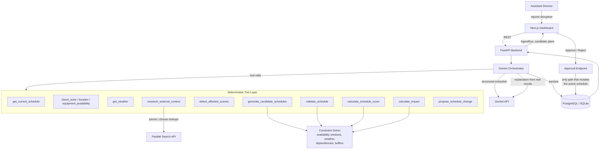

# Production Rescue

**When production changes, your schedule changes with it.**

Production Rescue is an autonomous AI production-operations platform for film, television, and media
productions. It acts as an AI Assistant Director: when a disruption hits (weather, cast availability,
equipment delays, lost locations), it investigates the current shooting schedule, checks every affected
resource, generates and scores alternative schedules, and recommends a rescue plan, complete with a
plain-English explanation and a quantified operational impact. A human Assistant Director still makes the
final call.

> Built for the **Agentic Cinema: The Blockbuster Hackathon**. Google Cloud + Gemini orchestration, with
> [Parallel](https://parallel.ai) as the external-research partner integration.

## The problem

A single disruption on a shoot day (a storm, an actor's flight, a delayed camera truck) can cascade across
dozens of interconnected constraints: cast availability, location windows, equipment, weather, scene
dependencies, daylight, and budget. Rebuilding a shooting schedule by hand under time pressure is slow and
error-prone, and the operational cost of getting it wrong (idle crew, lost scenes, overtime) is immediate
and expensive.

## The solution

Report what changed in plain English. Production Rescue:

1. Extracts the disruption into structured data (Gemini).
2. Retrieves today's schedule and identifies every affected scene, with a specific reason for each.
3. Checks actor, location, equipment, and weather constraints for the affected window.
4. Runs a deterministic constraint solver to generate and score candidate alternative schedules.
5. Calculates the operational impact of the best candidates against a "do nothing" baseline.
6. Recommends a plan with a concise, factual explanation, grounded entirely in the numbers the solver
   computed. Never a hallucinated fix.
7. Waits for a human Assistant Director to approve, reject, or pick an alternative.
8. Only on approval does it update the active schedule and record the decision in an audit log.

**AI proposes. Humans approve. Production continues.**

## Demo

The MVP ships with one fully worked scenario: *Project Aurora*, shooting day 18 of 42, five scenes across
two exterior and two interior locations. Introduce a thunderstorm, a lead actor's early departure, and a
delayed camera, and the agent independently derives that four of the five scenes can be saved with zero
hard conflicts, while the fifth genuinely cannot be shot today (the dry-and-daylight window left after the
storm clears is shorter than the scene needs) and should move to another shooting day. Nothing about that
outcome is hardcoded: it falls out of the constraint solver run against the reported disruption.

Click **Simulate Demo Emergency** on the Command Center to run it end to end.

## Architecture



The critical architectural decision: **Gemini never computes a schedule.** It decides which tools to call
and narrates the results; every number (availability, score, downtime, cost) comes from plain deterministic
Python. `apply_schedule_change` is not a tool the agent can call at all; it only exists behind the
human-approval API endpoint. That split is enforced by the code structure, not just a prompt instruction,
and is covered by an explicit test (`test_agent_never_mutates_the_active_schedule`).

## Agent workflow

`backend/app/agents/orchestrator.py` runs one rescue analysis:

1. Parse the disruption text (Gemini structured output, schema-validated with Pydantic; falls back to a
   deterministic regex/keyword parser if no API key is configured or the call fails).
2. Build a `DayContext`: every scene's constraints, with availability windows clipped by the parsed
   disruptions.
3. **If Gemini is configured**, hand it the tool declarations and let it drive real function calling
   (`google-genai`, verified against the SDK's schema requirements) to investigate the situation and call
   `propose_schedule_change` itself.
4. **Otherwise (or if that call fails for any reason)**, a deterministic pipeline runs the identical tool
   functions in the documented order. Either way, the *scheduling* result is the same; only who decides
   the call order differs. This is what makes `NEXT_PUBLIC_DEMO_MODE` reliable without any API key.
5. Every tool call is persisted as an `AgentAction` row: real input/output, not a scripted animation.
6. The top-scoring valid candidates are persisted as `PROPOSED` schedule versions (Plan A/B/C), each with
   its own impact snapshot.
7. Gemini turns the structured recommendation into a 2-3 sentence explanation, grounded in the computed
   numbers (mock fallback if unavailable).

If no valid candidate exists at all, the run is marked `infeasible` with the specific blocking constraints
and suggested human interventions. No hallucinated fix is ever returned.

## Google Cloud / Gemini integration

- `google-genai` SDK, configurable for the Gemini Developer API or Vertex AI (`GOOGLE_GENAI_USE_VERTEXAI`).
- Used for structured disruption extraction (`response_schema` against a Pydantic model) and for real
  function-calling tool orchestration.
- The tool layer (`app/agents/tools.py`) is a plain Python registry of name -> function plus JSON-schema
  declarations, deliberately structured so it can be lifted into Google Cloud Agent Builder / Gemini
  Enterprise without rewriting the underlying logic.

## Partner integration: Parallel

`backend/app/services/partner_service.py` is a real adapter for the [Parallel](https://parallel.ai) Search
API: authenticated request construction, `tenacity` retry on transient failures, response validation, and a
clearly-labeled mock fallback (never presented as a live result) when `PARALLEL_API_KEY` is unset. It's
wired into the agent as the `research_external_context` tool, called whenever a `location_unavailable`
disruption is reported, so the agent can look outward (permit status, closures, local events) instead of
only at its own schedule database.

## Tech stack

| Layer | Technology |
|---|---|
| Frontend | Next.js 16, React 19, TypeScript, Tailwind CSS v4, shadcn/ui, Recharts, React Flow, Lucide |
| Backend | Python, FastAPI, Pydantic, SQLAlchemy |
| Database | PostgreSQL (SQLite fallback for local dev) |
| AI | Gemini via `google-genai` (Developer API or Vertex AI) |
| Partner | Parallel Search API |

## Local setup

### Backend

```bash
cd backend
python3 -m venv .venv && source .venv/bin/activate
pip install -r requirements.txt
cp ../.env.example ../.env   # edit as needed; unset GOOGLE_API_KEY / PARALLEL_API_KEY run fine in mock mode
python seed.py                # seeds Project Aurora into SQLite by default
uvicorn app.main:app --reload --port 8000
```

Run the test suite:

```bash
pytest
```

### Frontend

```bash
cd frontend
npm install
cp .env.local.example .env.local   # or just edit NEXT_PUBLIC_API_BASE_URL
npm run dev
```

Open `http://localhost:3000` (or whichever port you ran it on).

### Docker Compose (Postgres + backend + frontend)

```bash
docker compose up --build
```

## Deploying to production (Cloud Run + Vercel)

The hackathon deploy targets Google Cloud Run for the backend (reinforcing the Google Cloud integration)
and Vercel for the Next.js frontend. Both build remotely from this GitHub repo; no local Docker build is
required.

**Backend, Google Cloud Run:**

1. In the [Cloud Run console](https://console.cloud.google.com/run), create a service and choose
   "Continuously deploy from a repository," connecting this GitHub repo.
2. Set the source directory to `backend` and the build type to Dockerfile (`backend/Dockerfile`).
3. Leave `DATABASE_URL` unset. The container seeds an ephemeral SQLite database on every start (same as
   `docker-compose`); one demo production doesn't need Cloud SQL. Set `min instances` to `1` so approvals
   made during a demo stay on the same instance's SQLite file rather than a fresh cold-started copy.
4. Add environment variables/secrets as needed: `GOOGLE_API_KEY` (enter it directly in the console, never
   in chat or committed to the repo), `GEMINI_MODEL`, `PARALLEL_API_KEY`, and `CORS_ORIGINS` (add your
   Vercel URL once you have it, see below).
5. Deploy, then copy the resulting `*.run.app` service URL.

**Frontend, Vercel:**

1. Import this GitHub repo at [vercel.com/new](https://vercel.com/new).
2. Set the project's Root Directory to `frontend`.
3. Set `NEXT_PUBLIC_API_BASE_URL` to the Cloud Run URL from above, and `NEXT_PUBLIC_DEMO_MODE=true`.
4. Deploy, then copy the resulting `*.vercel.app` URL.
5. Back in Cloud Run, update `CORS_ORIGINS` to include that Vercel URL and redeploy the revision.

## Environment variables

See [`.env.example`](.env.example) for the full list. Nothing sensitive is ever exposed client-side; only
`NEXT_PUBLIC_*` variables reach the browser, and those carry no credentials.

| Variable | Purpose |
|---|---|
| `DATABASE_URL` | Postgres connection string; omit for local SQLite |
| `GOOGLE_API_KEY` / `GOOGLE_GENAI_USE_VERTEXAI` / `GOOGLE_CLOUD_PROJECT` | Gemini credentials |
| `PARALLEL_API_KEY` | Parallel Search API key |
| `CORS_ORIGINS` | Comma-separated allowed frontend origins |
| `NEXT_PUBLIC_API_BASE_URL` | Backend URL the frontend calls |
| `NEXT_PUBLIC_DEMO_MODE` | Enables the deterministic "Simulate Demo Emergency" shortcut |

## API overview

```
GET  /api/productions
GET  /api/productions/{id}
GET  /api/productions/{id}/shooting-days
GET  /api/shooting-days/{id}/schedule
GET  /api/scenes/{id}
GET  /api/actors | /api/locations | /api/equipment
POST /api/disruptions/parse
POST /api/rescue/analyze
GET  /api/agent-runs | /api/agent-runs/{id}
GET  /api/agent-runs/{id}/events        # SSE replay of the tool-call trace
GET  /api/rescue/{id}/alternatives
POST /api/rescue/{id}/approve
POST /api/rescue/{id}/reject
GET  /api/analytics
```

## Scheduling algorithm

`backend/app/services/scheduling_service.py` is pure, deterministic Python; no LLM involved:

- **Interval arithmetic** (`interval_utils.py`): intersect/subtract availability windows for actors,
  locations, equipment, weather blackouts, and daylight, per scene.
- **Candidate generation**: pruned permutation search over scene ordering (dependency-order violations are
  skipped before ever being built), greedily assigning each scene the earliest feasible start time subject
  to a single-unit crew cursor, company-move/same-location transition buffers, and dependency ordering.
  Appropriate for the documented MVP scope (small single-day schedules); a larger production would swap
  this for OR-Tools without touching the surrounding contract.
- **Validation**: independently re-checks every hard constraint (actor/location/equipment availability,
  weather, day bounds, overlaps, dependencies) so a candidate's own generation logic is never trusted
  blindly. A violation invalidates the candidate outright; it does not just lower its score.
- **Scoring**: `0.30 feasibility + 0.20 downtime + 0.15 cast + 0.15 location + 0.10 equipment + 0.10 priority`,
  each component a normalized, explainable metric (e.g. priority is weighted by the *share of total
  priority-weighted value preserved*, specifically so a plan can't game the score by dropping several scenes
  to make the rest trivially easy).
- **Impact**: diffs the proposed plan against a naive "keep the original order, never start a scene before
  its original call time" baseline, so the reported downtime/cost avoided reflects the actual value of
  proactive rescheduling, not just doing nothing.

## Safety / human-approval model

- The agent's tool registry does not include a mutation tool. `apply_schedule_change` only exists behind
  `POST /api/rescue/{id}/approve`.
- Every proposed plan is persisted with `status=PROPOSED`; the shooting day's `is_current` schedule version
  never changes until a human explicitly approves.
- Rejecting a plan marks it `REJECTED` and leaves the active schedule untouched.
- Every decision (approve or reject, by whom, when) is recorded as an `Approval` row.
- If no feasible plan exists, the run is marked `infeasible` with the specific blocking constraints; the
  system never fabricates a schedule that doesn't actually satisfy them.

## Hackathon requirements checklist

- [x] Genuine multi-step agentic workflow (parse -> investigate -> generate -> validate -> score -> impact
      -> propose), with real Gemini function calling when configured.
- [x] Google Cloud / Gemini integration for orchestration and reasoning, deterministic tools for computation.
- [x] Eligible partner integration (Parallel), real adapter with auth/retry/validation, not decorative.
- [x] Human-in-the-loop approval gate enforced at the architecture level, not just the UI.
- [x] Full-stack, coherent product: Next.js dashboard, FastAPI backend, Postgres-ready schema, tested
      solver.

## License

MIT. See [LICENSE](LICENSE).
